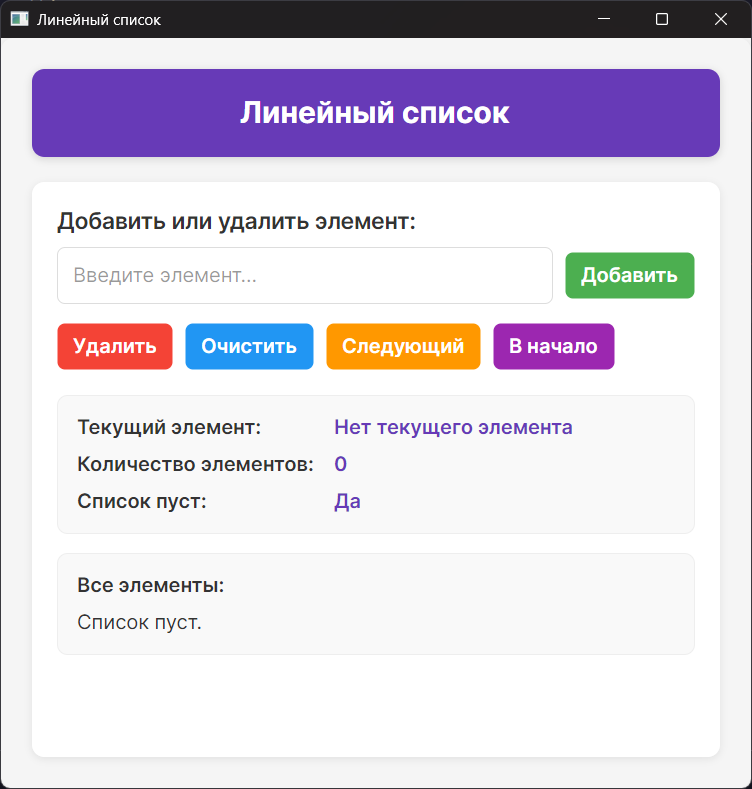

## Быханов Артём, ФКН, ИСИТ, 3 курс, 3 группа.

# Задание 1: Линейный список


## Описание
Класс «Линейный_список».
Свойства: текущий элемент, количество элементов, признак пуст ли список (IsEmpty).
Методы: добавления и удаления элементов, перехода к следующему элементу (если переход к следующему элементу не возможен, возвращает false, иначе - true), переход в начало.

Программа разработана с использованием фреймворка Avalonia UI и языка программирования C#.

## Функциональные возможности

### Основные операции со списком:
- **Добавление элементов** - добавление новых элементов в конец списка
- **Удаление элементов** - удаление элементов по значению или удаление текущего элемента
- **Очистка списка** - полная очистка списка
- **Навигация по списку** - переход к следующему элементу и в начало списка

### Информация о списке:
- **Текущий элемент** - отображение значения текущего элемента
- **Количество элементов** - отображение количества элементов в списке
- **Признак пустоты** - пуст ли список
- **Все элементы** - отображение всех элементов списка

## Запуск программы

### Требования
- .NET 8.0 или выше
- Операционная система: Windows, macOS или Linux

### Запуск из исходного кода
1. Убедитесь, что у вас установлен .NET SDK 8.0 или выше
2. Клонируйте репозиторий или скачайте исходный код
3. Откройте терминал и перейдите в директорию с проектом
4. Выполните команду:
   ```
   dotnet run
   ```